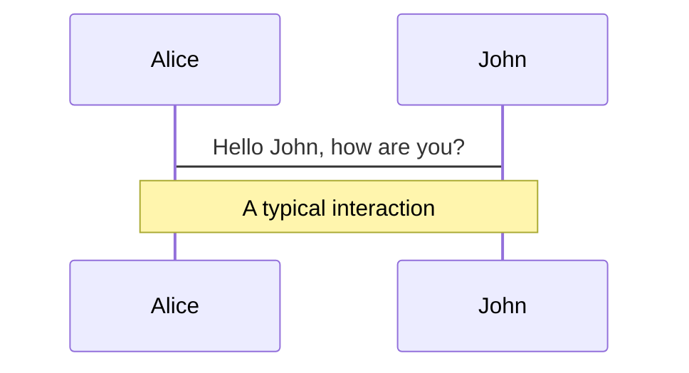
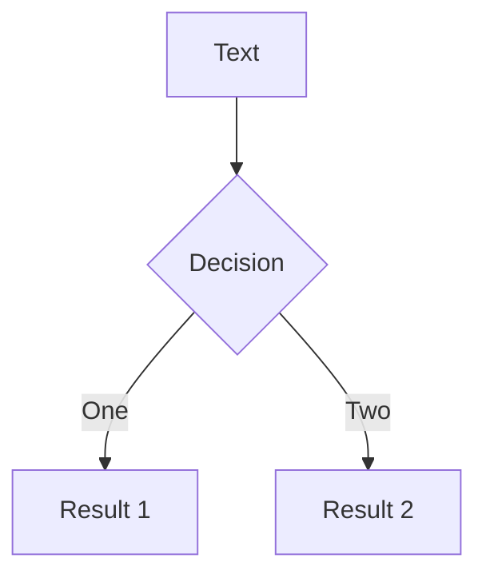
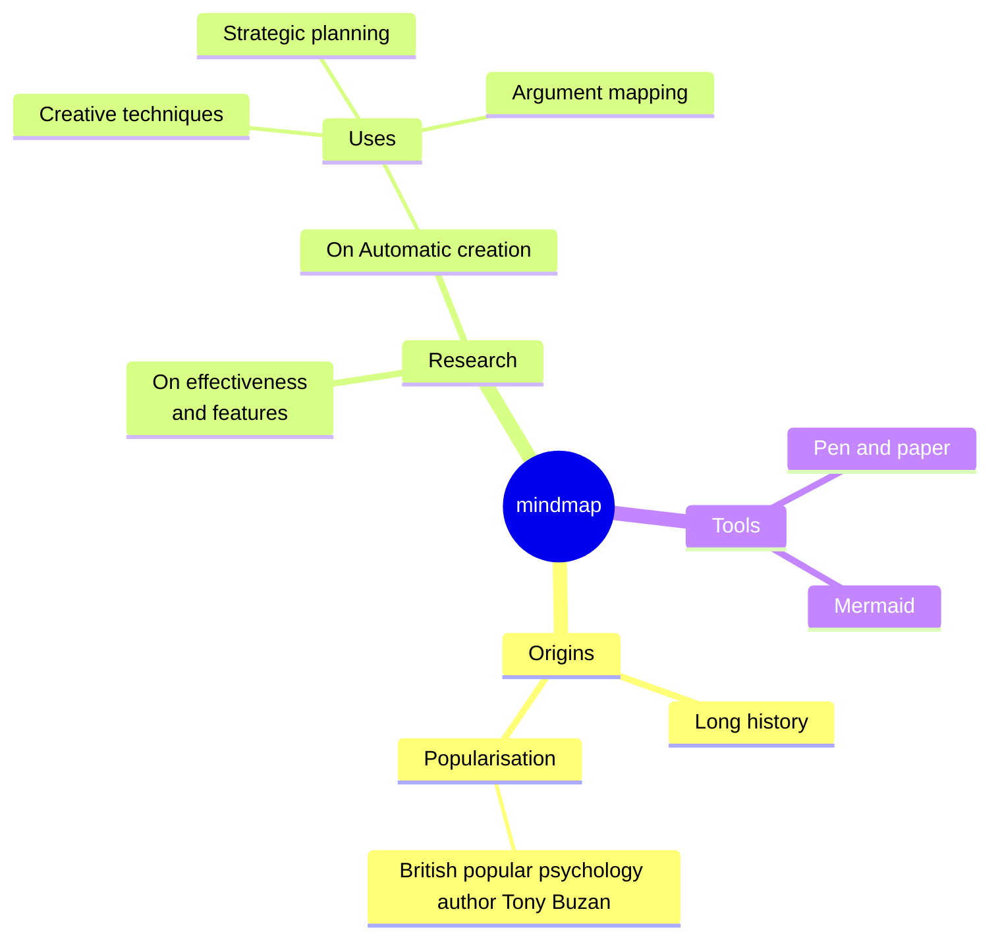
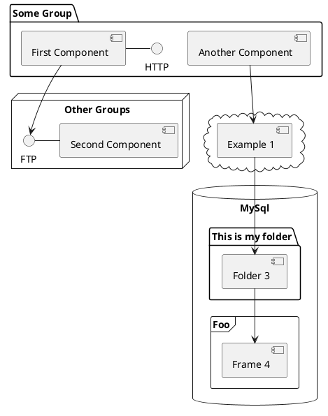

---
# try also 'default' to start simple
theme: seriph
# random image from a curated Unsplash collection by Anthony
# like them? see https://unsplash.com/collections/94734566/slidev

# some information about your slides (markdown enabled)
title: "HoTPP benchmark: Are we good at the long horizon events forecasting?"
info: |
  ## HoTPP benchmark
  LAMBDA Seminar

  Learn more at [GitHub repo](https://github.com/ivan-chai/hotpp-benchmark)
# apply UnoCSS classes to the current slide
class: text-center
# https://sli.dev/features/drawing
drawings:
  persist: false
# slide transition: https://sli.dev/guide/animations.html#slide-transitions
transition: slide-left
# enable Comark Syntax: https://comark.dev/syntax/markdown
comark: true
# duration of the presentation
duration: 35min
---

### HoTPP benchmark: Are we good at the long horizon events forecasting?

HSE $\bullet$ LAMBDA Seminar

16.03.2026

<!--
The last comment block of each slide will be treated as slide notes. It will be visible and editable in Presenter Mode along with the slide. [Read more in the docs](https://sli.dev/guide/syntax.html#notes)
-->

---
layout: two-cols
---

# Event Sequences

- Internet activity, banking transactions, retail operations, clinical
visits
- Compared to Time Series:
    - *irregular time intervals*
    - *additional data fields*
- **Temporal Point Process (TPP)** - only timestamps
- **Marked TPP (MTPP)** - timestamps + labels

[Paper Link](https://www.sciencedirect.com/science/article/abs/pii/S0925231226001682)

::right::

  

TPP Example [shchur.github.io](https://shchur.github.io/blog/2021/tpp2-neural-tpps/)

<!--
Here is another comment.
-->

---

# MTPP

Marked Temporal Point Process

MTPP is a stochastic process $(t_1, l_1), (t_2, l_2), \dots$, where $t_1 < t_2 < \dots$, $l_i \in \{1, \dots, L\}$.

Using intensity funciton $\lambda(t) \geqslant 0$, given the event history $\mathcal H_t = \{ t_i : t_i < t \}$, the conditional density of the next event timestamp is:

$$
f^*(t) = \lambda(t) \exp \left( -\int_{t_{\text{last}}}^t \lambda(s) ds \right)
$$

- *Homogeneous Poisson process* $\lambda(t) = \lambda$. Time between events follows exponentional distribution.
- *Non-homogeneous Poisson process* allows a time-varying intensity $\lambda(t)$.
- Self-exciting *Hawkes process*:

$$
\lambda(t) = \lambda_0(t) + \sum\limits_{t_i < t}\phi(t - t_i)
$$

$\phi(t) \geqslant 0$ - memory kernel.

---

# MTPP

Marked Temporal Point Process

- **Homogeneous Poisson process**:
    - events occur at a constant rate
    - indepentend from past events
- **Non-homogeneous Poisson process**:
    - indepentend from past events
    - seasonal or periodic changes in event frequency
- **Hawkes process**:
    - past events increase the likelihood of future events

Generalizable to MTPP by predicting each label as a separate TPP sequence.

---

# Neural Networks

1. **Intensity-based** methods use MTPP formalism
    - predict Hawkes process parameters after each event
    - represent arbitrary continuous-time intensities
2. **Intensity-free** approaches use RNN or Transformer
    - MAE or MSE for timestamp delta
    - CrossEntropy for labels

Most use autoregression, but there are methods that predict multiple events in a single pass.

---

# Paper Contributions

1. Open-source benchmark designed explicitly for long-horizon event forecasting
2. T-mAP, T-F1, and T-Edit metrics
3. Evaluate various approaches against statistical baselines
4. Analyze the results

 

---

# Long Horizon Forecasting

Formal statement

---

---

# Diagrams

You can create diagrams / graphs from textual descriptions, directly in your Markdown.

Learn more: [Mermaid Diagrams](https://sli.dev/features/mermaid) and [PlantUML Diagrams](https://sli.dev/features/plantuml)

<PoweredBySlidev mt-10 />
