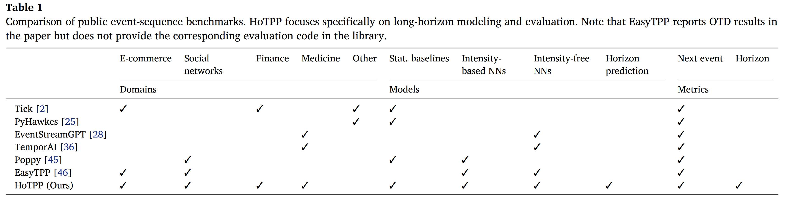
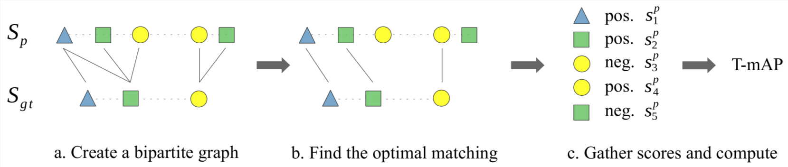
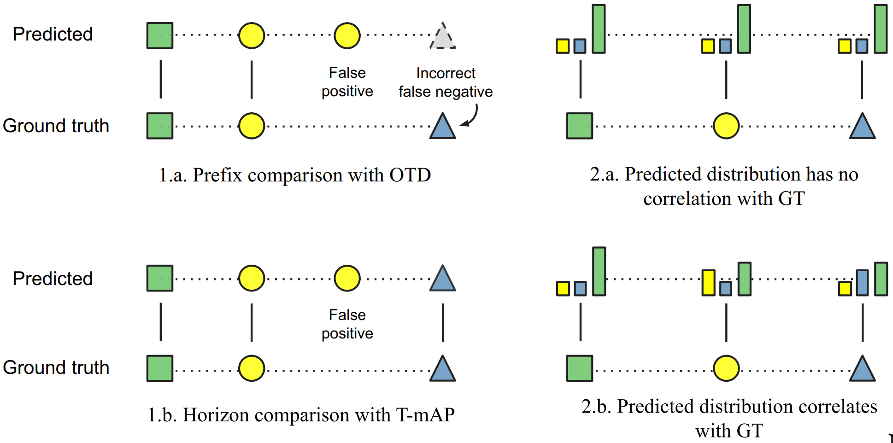
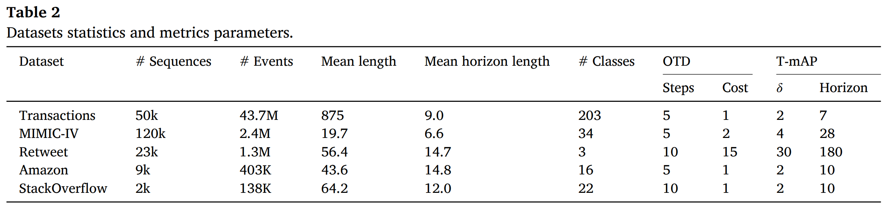
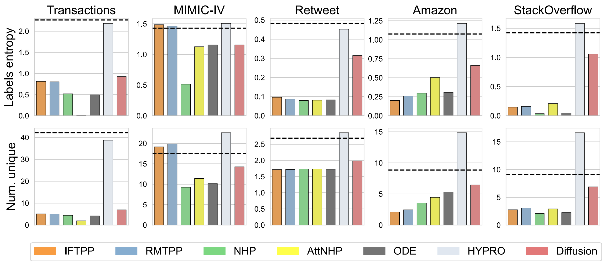
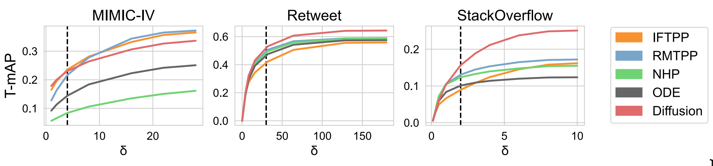
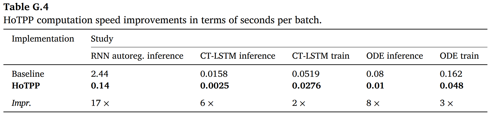
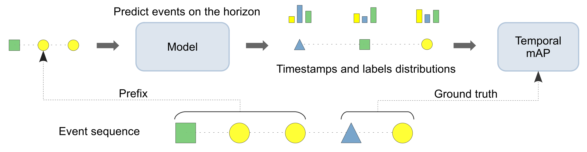

### HoTPP benchmark: Are we good at the long horizon events forecasting?

HSE $\bullet$ LAMBDA Seminar

16.03.2026

<!--
The last comment block of each slide will be treated as slide notes. It will be visible and editable in Presenter Mode along with the slide. [Read more in the docs](https://sli.dev/guide/syntax.html#notes)
-->

---
layout: two-cols
---

# Event Sequences

- Internet activity, banking transactions, retail operations, clinical
visits
- Compared to Time Series:
    - *irregular time intervals*
    - *additional data fields*
- **Temporal Point Process (TPP)** - only timestamps
- **Marked TPP (MTPP)** - timestamps + labels

[Paper Link](https://www.sciencedirect.com/science/article/abs/pii/S0925231226001682)

::right::

  

TPP Example [shchur.github.io](https://shchur.github.io/blog/2021/tpp2-neural-tpps/)

<!--
Here is another comment.
-->

---

# MTPP

Marked Temporal Point Process

MTPP is a stochastic process $(t_1, l_1), (t_2, l_2), \dots$, where $t_1 < t_2 < \dots$, $l_i \in \{1, \dots, L\}$.

Using intensity funciton $\lambda(t) \geqslant 0$, given the event history $\mathcal H_t = \{ t_i : t_i < t \}$, the conditional density of the next event timestamp is:

$$
f^*(t) = \lambda(t, \mathcal H_t) \exp \left( -\int_{t_{\text{last}}}^t \lambda(s, \mathcal H_t) ds \right)
$$

- *Homogeneous Poisson process* $\lambda(t, \mathcal H_t) = \lambda_0$. Time between events follows exponentional distribution.
- *Non-homogeneous Poisson process* allows a time-varying intensity $\lambda(t, \mathcal H_t) = \lambda_0(t)$.
- Self-exciting *Hawkes process*:

$$
\lambda(t, \mathcal H_t) = \lambda_0(t) + \sum\limits_{t_i < t}\phi(t - t_i)
$$

$\phi(t) \geqslant 0$ - memory kernel.

---

# MTPP

Marked Temporal Point Process

- **Homogeneous Poisson process**:
    - events occur at a constant rate
    - indepentend from past events
- **Non-homogeneous Poisson process**:
    - indepentend from past events
    - seasonal or periodic changes in event frequency
- **Hawkes process**:
    - past events increase the likelihood of future events

Generalizable to MTPP by predicting each label as a separate TPP sequence.

---

# Neural Networks

1. **Intensity-based** methods use MTPP formalism
    - predict Hawkes process parameters after each event
    - represent arbitrary continuous-time intensities
2. **Intensity-free** approaches use RNN or Transformer
    - MAE or MSE for timestamp delta
    - CrossEntropy for labels

Most use autoregression, but there are methods that predict multiple events in a single pass.

---

# Paper Contributions

1. Open-source benchmark designed explicitly for long-horizon event forecasting
2. T-mAP, T-F1, and T-Edit metrics
3. Evaluate various approaches against statistical baselines
4. Analyze the results

 

---

# T-mAP

Long horizon forecasting formal statement

- Predicted $(t^p, l^p)$, true $(t^{gt}, l^{gt})$
- Correct prediction criteria:
    1. $|t^p - t^{gt}| \leqslant \delta$
    2. $l^p = l^{gt}$

**Temporal mean Average Precision** (T-mAP):

- Horizon length $T$, maximum allowed $\delta$
- Within the horizon, select classifier threshold $h$ and filter predicted events
- Find a matching with ground truth that maximizes precision and recall (cover $c$) using Jonker-Volgenant algorithm
- Vary threshold $h$ to obtain a precision-recall curve and obtain Average Precision (AP)

---

# T-mAP

- Sequences $S_p^l$ and $S_{gt}^l$
- Create bipartite graph with edge weights $-s_i^p$ - logits
- Jonker-Volgenant algorithm finds the matching with the maximum number of edges in the graph, such that the resulting matching minimizes the total cost of the selected edges

**Theorem 3.1.** For any threshold $h$ there exists an optimal matching in the graph $\mathcal G_h$, that is, a subset of an optimal matching in the full graph $\mathcal G$.

We can compute the matching for the prediction $S_{gt}^l$ and subsequently reuse it for all thresholds $h$.

---

# T-mAP Vs OTD

---

# Datasets

 

---

# Label Entropy

 

---

# T-mAP delta

 

---

# Compute Efficiency

 

---

# T-mAP Pipeline

 

---
layout: center
---

# Thank you!

<PoweredBySlidev mt-10 />

